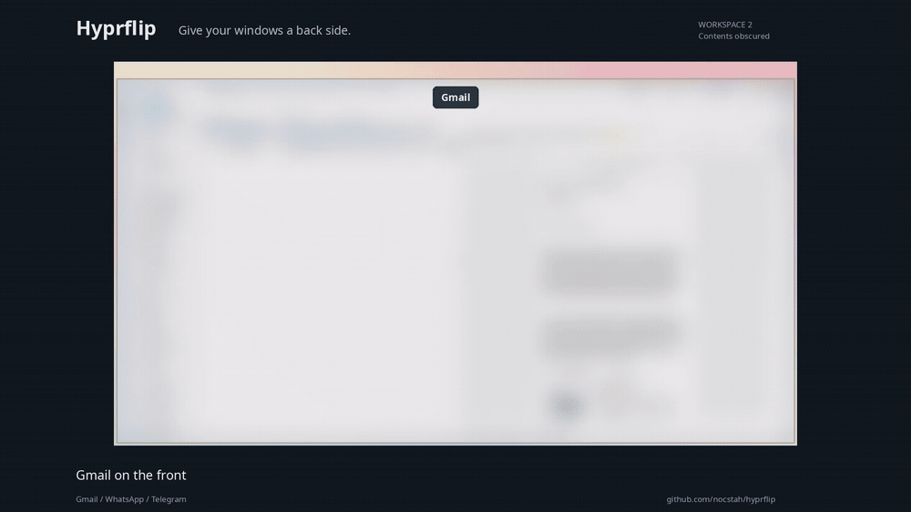

# Hyprflip

**Give your windows a back side.**

Keep Gmail on the front and WhatsApp + Telegram on the back. Flip to the apps
you need, briefly peek at the other side, or unfold the whole card to work with
both faces together. Each app stays a real, live window with its own state.

[](media/hyprflip-demo.mp4)

**[Watch / download the demo — MP4](media/hyprflip-demo.mp4)** ·
[Poster](media/hyprflip-poster.png) · [Recording details](media/README.md)

Actual desktop footage. The multi-app card in the video uses the optional
**experimental hy3 integration**.

[Features](#features) · [Install](#install) · [First card](#make-your-first-card) ·
[Shortcuts](#shortcuts) · [Transitions](#transitions) ·
[Compatibility](#compatibility-and-limits) · [Documentation](#documentation)

**Early release:** targets **Hyprland 0.56.2**, with matching development headers
and compiler ABI. The core is a native C++/GLES plugin. Multi-app cards use a
separately built, pinned hy3 provider. **Omarchy is optional:** menus prefer its
running shell, then automatically fall back to **Fuzzel, Rofi or Wofi**.

## Features

| Feature | What it does |
| --- | --- |
| **Two faces, one tile** | Switch between related applications without moving to another workspace. |
| **Up to five apps per face** | Arrange each face in a row or column: up to ten apps in one card. |
| **Flip and reverse** | Turn the card with perspective, easing and shared lighting. Press flip again mid-turn to smoothly reverse it. |
| **Hold to peek** | Hold a key to reveal the other side; release to return. Clicking or typing keeps the side you are using. |
| **Temporary unfold** | Show both faces together in the existing tile. Use any app, then fold onto the face you want. |
| **Drag to add** | Move an outside app onto a face’s temporary drop target. Escape cancels. |
| **Appearance and spacing** | Choose Classic tabs or Card frame, with desktop or compact gaps. |
| **Edit either side** | Add or remove any app, including an unfocused pane. Released apps stay open. |
| **Replace an app** | Exchange a pane with an open app while retaining its position and share of the side. The previous app stays open. |
| **Layout controls** | Choose beside, stacked or equal sizes. Swap two apps, reorder larger faces, or move an app to the other face. |
| **Apps from other workspaces** | Pick local apps first, or open an **Add from workspace X** submenu to bring another app into the card. |
| **Saved cards** | Name an arrangement and reopen it with its apps, split directions, proportions, remembered focus and visible face. |
| **Workspace destinations** | Assign a saved card to a workspace. Opening it brings the whole card there, including an existing open card. |
| **Floating cards** | Float a multi-app card, then move or resize it from any visible pane. Both faces stay together. |
| **Launch and repair** | Reuse open apps, launch missing apps through installed launchers, or reopen missing panes in a surviving saved card. |
| **Find hidden apps** | Search apps across open cards; reveal the right face and focus the exact pane, even on another workspace. |
| **Optional mouse flip** | Super+Ctrl+Alt+middle-click turns the focused card on release. |
| **Card library** | Search, open, update, rename, duplicate and delete saved definitions. An already-open card is focused without duplication. |
| **Move the whole card** | Optional navigation bindings move every member to another workspace or reorder the card beside neighboring tiles. |
| **Seven transitions** | Flip, Vertical flip, Slide, Fade, Dissolve, Portal and Instant, with preview and a saved preference. |
| **Omarchy integration** | Native themed menus, Super+J split toggling, and an Omachill adapter that protects card arrangements. OmaCards adds motion and shortcut settings. |

### Choose your setup

| | Native pairs | Experimental cards |
| --- | --- | --- |
| Apps per face | One | One to five |
| Layout | Native Hyprland groups; dwindle tested | Pinned hy3 for tiled cards; native groups for floating cards |
| Floating windows | A pair can be floating | Whole multi-app cards can float, move and resize together |
| Flip, transitions and peek | Yes; custom binding for peek | Yes |
| Unfold, pane editing and whole-card navigation | — | Yes |
| Guided menus and saved-card library | — | Optional helper: Omarchy shell, Fuzzel, Rofi or Wofi |
| Installation | Supplied core installer or hyprpm | Core + matching provider + optional helper |

The default installer and hyprpm install **native pairs**. Follow the
[container installation guide](docs/INSTALL.md#experimental-multi-app-cards)
to get the workflow shown in the video. The five-app limit is Hyprflip's
supported model; it is not a limit of hy3 itself.

## Install

You need Hyprland **0.56.2**, its matching development headers, a matching
C++26-capable compiler, CMake 3.25+, Ninja, pkg-config, Lua 5.4 and GLES libraries.
The installer also needs Python 3 and an existing Hyprland Lua configuration.

### Native two-window pairs

Run from a terminal in your Hyprland session:

```sh
git clone https://github.com/nocstah/hyprflip.git
cd hyprflip
make test
python3 scripts/install.py --dry-run
python3 scripts/install.py
```

The installer checks shortcut conflicts, backs up affected files, installs the
core and Lua bindings, reloads configuration and validates the result. Existing
native pairs and customized settings are preserved during an update.

Prefer hyprpm? Use the [hyprpm instructions](docs/INSTALL.md#hyprpm).
For another configuration layout, use the
[manual loading instructions](docs/INSTALL.md#manual-core-loading).
Use one installation method for the core.

### Multi-app cards shown in the demo

The container build fetches the pinned hy3 source and builds both libraries:

```sh
./scripts/build-containers
```

Try it in a disposable nested desktop before enabling a real workspace:

```sh
python3 tests/nested_session.py --directory /tmp/hf-demo --containers
```

This demo needs `foot` and a running Wayland session. Click inside it and use
**F8** to flip. Stop its launcher with **Ctrl+C** when finished. F6/F7/F8 are
**demo-only** shortcuts.

Then follow **[first-time container activation](docs/INSTALL.md#first-time-activation)**
to install the provider, enable workspace 8 and add the guided menus. The guide
also covers all-workspace operation, navigation bindings, upgrades and removal.
Building alone does not install or load either library.

### Without Omarchy

Install the same core, provider and guided helper. The helper checks for a
responding Omarchy shell each time it opens; when unavailable it uses the first
installed picker in this order: **Fuzzel → Rofi with Wayland support → Wofi**.
No separate card database or compositor build is needed. Install one picker,
Python 3, libnotify and GLib; a notification daemon enables launch progress and
its Cancel action. OmaCards itself remains an optional Omarchy-only panel.

```sh
python3 scripts/setup.py --check-menu
HYPRFLIP_MENU=rofi python3 scripts/setup.py --cards
```

See [menu detection, dependencies and overrides](docs/INSTALL.md#add-the-guided-menus).

## Make your first card

### Gmail in front, WhatsApp + Telegram behind

With the container provider and guided setup enabled:

1. Open Gmail, WhatsApp and Telegram as separate app windows. A browser tab must
   first be in its own window.
2. On a hy3 workspace, focus Gmail and press **Super+Ctrl+Alt+O**.
3. Choose WhatsApp, then **Add Telegram**. Choose **Create card** if offered.
   Apps on other workspaces are available under **Add from workspace X**.
   Floating apps are resized to fit automatically.
4. The card groups automatically with Gmail in front. Press
   **Super+Ctrl+Alt+F** to turn it over.
5. Press **Super+Ctrl+Alt+O** to use all three apps together. Focus the side you
   want to keep and press O again with the same modifiers to fold back.

Already paired Gmail with WhatsApp? Flip to WhatsApp, press
**Super+Ctrl+Alt+C → Add an app to this side**, then choose Telegram.

For native pairs, focus the front app and press **Super+Ctrl+Alt+M**, focus the
back app and press **Super+Ctrl+Alt+P**, then use **F** with the same modifiers.
Both apps must share a workspace and both be tiled or both floating.

### Shape the card around your workflow

Focus the side you want to change and open **Super+Ctrl+Alt+C**:

- **Layout of this side…** changes direction, equalizes sizes, swaps two apps
  or reorders larger faces. **Super+J** keeps Omarchy's existing split-direction toggle.
- **Replace an app…** exchanges any pane with an open app, including one from
  another workspace. This also works on a full side or its only app.
- **Move an app to the other side…** transfers a pane while keeping at least
  one app on each face.
- **Remove [app] from card** releases that app. When it is the side's only app,
  the menu explicitly offers **Ungroup card** instead. Apps remain open.

### Save it for later

Choose **C → Save card…**, enter a name, then use **Super+Ctrl+Alt+L** to search
and open it. Selecting a running card switches to it. Otherwise, matching open
apps are reused and missing apps launch through their installed desktop entries.

After editing a saved card, use **C → Manage card… → Update saved card**.
The same menu offers Rename, Duplicate and Delete. If a pane closes while the
card survives, **C → Reopen missing apps** can restore it in place. If a whole
face disappears, use L to reopen the saved arrangement.

Saved cards remember the arrangement, not browser tabs or documents. They open
when requested rather than automatically at login. See
[matching, launchers, cancellation and storage](docs/SAVED_CARDS.md).

## Shortcuts

The optional [**OmaCards**](https://github.com/nocstah/omacards) Omarchy bar panel adds a visible card library, two-face
editor, floating-card controls, workspace destinations, and motion/shortcut settings.
With OmaCards enabled, C and L open its editor and
library; disabling it restores the original menu routes. Both interfaces use
the same saved cards and guarded workflows. After installing Hyprflip and its
guided helper, add the panel with:

```sh
omarchy plugin add https://github.com/nocstah/omacards.git --enable --yes
```

Use **Settings** for motion and keyboard shortcuts. Under a saved card, choose
**Manage → Workspace…** to assign its destination. See
[installation](docs/INSTALL.md#add-the-omacards-panel) and [the shared helper](docs/PANEL_API.md).

Hold **Super + Ctrl + Alt** for the following keys:

| Key | Action | Required setup |
| --- | --- | --- |
| **F** | Flip the focused pair or card | Core bindings |
| **M** / **P** | Mark the front / pair the focused app as the back | Core bindings |
| **U** | Ungroup the card; keep its apps open | Core bindings |
| **Escape** | Cancel a pending mark | Core bindings |
| **O** | Unfold/fold; on an ungrouped app, open guided creation | Containers; helper for creation |
| **C** | Edit a card, choose transitions or manage saved cards | Guided helper |
| **L** | Search and open saved cards | Guided helper |
| **K** | Find an app on either face of any open card | Guided helper |
| **Space**, held | Peek at the other side; release to return | Helper binding, or a custom core binding |
| **H** / **V** | Attach a marked app beside / below the focused pane | Container bindings |
| **E** | Release the focused pane | Container bindings |

Use **K** when you remember the app, and **L** when you want a saved arrangement.
Results in K show the workspace, face and whether the app is hidden.
[Optional mouse flip and standalone commands](docs/FIND_APPS.md).

Optional [navigation bindings](docs/INSTALL.md#move-cards-with-normal-shortcuts):

| Shortcut | Action |
| --- | --- |
| **Super+Shift+1…0** | Move the whole card to workspace 1…10 and follow it |
| **Super+Shift+Alt+1…0** | Move the card while staying on the source workspace |
| **Super+Shift+arrows** | Reorder the whole card toward a neighboring tile |

Without that module, ordinary window-move shortcuts may move only the focused
pane. Workspace destinations must be numbered; tiled hy3 cards also need a
hy3 destination. Floating cards keep their shared frame on other normal layouts.

## Transitions

Choose **C → Transition → mode → Preview** or **Use**. Preview turns over and
back; Use remembers the mode across reloads and restarts.

| Mode | Motion |
| --- | --- |
| **Flip** | Default horizontal perspective turn with live app surfaces |
| **Vertical flip** | A vertical perspective turn with live app surfaces |
| **Slide** | Slide between snapshots of the faces |
| **Fade** | Fade between face snapshots |
| **Dissolve** | Experimental patterned dissolve |
| **Portal** | Experimental portal-style reveal |
| **Instant** | Switch without an animation |

Snapshot effects hold app pixels only during the turn, then return to live
windows. Keep Flip or Vertical flip for live video during the motion.
All modes respect Hyprland's disabled animations and settle before new app input.

For custom Lua configurations:

```lua
hl.config({ plugin = { hyprflip = {
    duration_ms = 420,    -- 0–2000; 0 switches instantly
    transition = "flip", -- flip, vertical, slide, fade, dissolve, portal, instant
    enabled = true,
    notifications = true,
    card_frame = true,   -- false: classic tabs; true: experimental card frame
    card_gap = -1,       -- -1: desktop spacing; 12: compact; 0–128: custom empty gap
    drag_to_add = true,  -- Drop outside windows onto a card’s temporary target
    perspective = 5.0,   -- 2–8; higher means less perspective
    retreat = 0.02,      -- 0–0.2
} } })
```

See [transition behavior and Omachill integration](docs/TRANSITIONS.md).
The transition preference saved by the optional menu is reapplied on reload.

## Recognizing a card

In **OmaCards → Settings**, choose **Classic tabs** or **Card frame**.
The experimental frame has one outline around its visible apps, a **Front/Back** label and a
small **Flip** button. When both sides are unfolded, the button says **Fold**.
The focused app keeps its own focus outline, so you can see which app will
receive typing. Existing keyboard shortcuts continue to work.

The frame uses your Hyprland border colors and groupbar font settings. It is
built into Hyprflip; no additional border plugin is required. It replaces tab
bars only on cards owned by Hyprflip. Set `card_frame = false` to disable it;
native pairs and hy3 containers then use their original tab bars. Floating
multi-app cards retain their existing border-only appearance with this setting.
The hy3 frame needs the matching updated provider; older providers keep their
tabs until updated.

**Desktop spacing** follows `general:gaps_in` and workspace `gaps_in`
overrides, including directional gaps. **Compact spacing** leaves 12 logical
pixels between card apps, without changing ordinary tiles. Both apply to tiled
and floating cards and persist across restarts when chosen through OmaCards.
The Lua setting `card_gap` measures the full empty gap between borders; use
`-1` to follow the desktop, or an integer from `0` to `128` for a custom gap.

To add an outside app, hold your window-move modifier (normally **Super**) and
drag the app onto **Drop to add to Front/Back** near the card’s top. Release
there to add it to that side. Escape or releasing elsewhere keeps the normal
window move. When unfolded, each face has its own target. A full side explains
its five-app limit; application size limits can also refuse a drop. This works
with both appearances, for hy3 and floating-container cards. Native one-app
pairs need to be converted to a container first. Set `drag_to_add = false` to
turn off these targets.

## Compatibility and limits

- **Version pin:** Hyprland 0.56.2 only. Rebuild after compositor or ABI changes;
  other versions need adaptation and testing.
- **Containers:** one workspace, two faces, at most five apps in a row or
  column per face, tiled or floating. Nested flip cards and arbitrary pane trees
  are not implemented. Application minimum sizes can prevent a split
  or unfold; the existing card is kept when a change is refused.
- **Fullscreen and movement:** native pairs use native group behavior. Leave
  fullscreen before flipping, unfolding or moving an experimental container.
  Floating cards move and resize as a unit with normal desktop mouse bindings.
  Tiled card reordering uses the optional navigation bindings. Named/special-workspace
  card moves are not implemented.
- **Saved setups:** live card identities do not survive a compositor restart.
  The optional saved-card launcher recreates named arrangements when requested.
- **Omachill:** integration is optional and targets Omachill 1.2.0. Install the
  [adapter](docs/TRANSITIONS.md#chill-mode) before using Auto Chill with cards.
- **Hyprglass:** tested with the documented builds; its extra background pass
  is temporarily suppressed during a turn and restored afterward. Keep it
  loaded while the container updater replaces Hyprflip and hy3.
- **Rendering:** popups do not rotate. Unsupported geometry or surface conditions
  fall back to an instant switch. HDR, individual-window capture, other layouts
  and arbitrary plugin combinations need further testing.

For troubleshooting, run:

```sh
hyprctl hyprflip status
hyprctl configerrors
```

`status` lists native `pairs` and experimental `containers` separately, reports
`container_provider`, and includes `last_fallback` for instant-switch reasons.
See [installation and recovery](docs/INSTALL.md#troubleshooting) and the
[recorded validation](TESTING.md). Desktop tests cover real apps, fractional
scaling, rotated outputs, card editing, saved-card launching and plugin upgrades;
CI alone does not establish compositor or GPU compatibility.

## Documentation

- [Install, update, troubleshoot and remove](docs/INSTALL.md)
- [Container behavior, direct commands and Lua API](docs/CONTAINERS.md)
- [Saved cards, launchers and hold to peek](docs/SAVED_CARDS.md)
- [Find hidden apps and optional mouse flip](docs/FIND_APPS.md)
- [Transitions and Chill compatibility](docs/TRANSITIONS.md)
- [Validation and test commands](TESTING.md)
- [Roadmap](docs/ROADMAP.md) — gestures and other future ideas
- [Architecture and prior art](docs/DESIGN.md) — Compiz, Project Looking Glass
  and Apple Dashboard
- [Lessons from WinMux](docs/WINMUX_RESEARCH.md)
- [Contributing](CONTRIBUTING.md) · [Issues](https://github.com/nocstah/hyprflip/issues)

The core is [MIT licensed](LICENSE). The optional hy3 bridge is
[GPL-3.0-only](integrations/hy3/LICENSE), built with a separately fetched, pinned
hy3 source tree. See [integration licensing](integrations/hy3/README.md).
