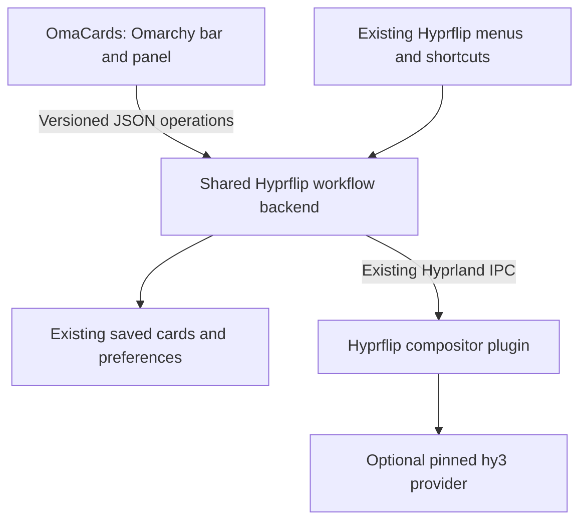

# OmaCards — an Omarchy interface for Hyprflip

Historical design proposal, 22 September 2026, subsequently implemented and extended.
The companion now has a shared backend, native panel, pane editor, saved-card
workflows and global motion controls. See [the implemented protocol](PANEL_API.md)
and [OmaCards](https://github.com/nocstah/omacards) for current behavior and installation.
The sections below preserve the original scope; floating cards, workspace
destinations and editable shortcuts were added during implementation.

The user selected a compact bar panel alongside the existing keyboard shortcuts.

## Product and name

OmaCards makes Hyprflip's card workflows visible and easy to adjust from Omarchy:
open an arrangement, understand its two sides, edit its apps, and tune its motion.
Hyprflip remains the window-management engine and works independently of this UI.

**OmaFlip is already used** by [HowieDuhzit/OmaFlip](https://github.com/HowieDuhzit/OmaFlip),
a native Flipper Zero manager for Omarchy. Use **OmaCards — powered by Hyprflip**
as the working name. A public GitHub repository-name search found no OmaCards
match on this date; this is a naming check, not a reservation or legal clearance.

Proposed plugin ID: `io.github.nocstah.omacards`. Proposed UI repository:
`nocstah/omacards`, to be created during implementation, not by this plan.

## Experience

This is an everyday desktop control, so it should inherit Omarchy's typography,
colors, focus behavior, spacing and popup components. Its main task is acting on
the current card or opening a saved one. It should feel usable without memorizing
shortcuts, while leaving the fast keyboard workflow intact.

One panel has three views: **Cards**, **Edit**, and **Motion**. It remembers its
navigation while open; ordinary reopening starts at Cards. C can enter Edit and
L can enter the searchable library directly once those routes reach parity.

### Cards: the home view

Illustrative content, using the user's existing workflow:

```text
Cards                                      [Motion]

Communications                         Workspace 2
Front: Gmail                              Showing
Back:  WhatsApp · Telegram

[Flip]       [Unfold]       [Edit]       [Save…]

Search saved cards…
Communications                 Go to · Workspace 2
Research                                Open here

[Create card…]
```

- The bar icon opens this panel. Keep the icon stable; clicks open controls and
  do not unexpectedly flip a window. A contextual tooltip can describe the card.
- Show the card associated with the app that had focus when the panel opened.
  With several cards on the workspace, provide a small selector.
- A saved card that is already open offers **Go to · Workspace N**. A closed
  arrangement offers **Open here**. Selecting it performs that action directly.
- Reuse matching apps and launch missing ones. Show remote workspace imports
  and tiling in the row's description before activation, as the current helper does.
- An empty workspace still offers the saved library. An ungrouped app offers
  **Create card with Gmail** and **Choose a second app** instead of an error.
- Card creation gathers choices first and finishes grouped and folded onto Front.
- Keep the existing two-face, one-to-three-apps-per-face model visible in the UI.

### Edit: two faces that are easy to understand

Show Front and Back together as simple app lists with a small row/column diagram.
Highlight the visible face with a text label as well as the theme accent.
Use app icons and labels; live screenshots are unnecessary for the first release.

Each pane has a small action menu: **Replace**, **Move to other side**, and
**Remove from card**. Removal explicitly keeps the app open. The last app on a
face offers **Ungroup card**, with its consequence shown, rather than pretending
the card can have an empty face.

Each face has **Add app**, **Beside**, **Stacked**, **Equal sizes**, and directional
reorder buttons when applicable. Manage any pane, including an unfocused one.
At three apps, explain that the side is full and keep Replace available.

App selection lists the current workspace first and other workspaces below,
grouped by workspace. Apps already belonging to another card/group are excluded
with an understandable reason where useful. Reuse the current floating/Chill
handoff and restoration behavior.

The chosen card and face are explicit action targets. Merely inspecting the
Back list must not flip the desktop. Where the existing engine requires activating
the target face, use an explicit **Show and edit Back** action in the initial
editor; seamless edits to a hidden face can follow after the focus contract is
proven. Do not silently retarget edits to whichever app gains focus next.

Live edits take effect immediately. **Update saved card** deliberately saves the
current arrangement; editing a running card never silently overwrites its saved
definition. For ambiguous matches, ask which saved name to update. Rename and
Duplicate retain their current atomic behavior. Delete removes only the saved
definition, with the existing confirmation.

### Motion: a few useful choices

- Transition: Flip, Vertical flip, Slide, Fade, Instant; Dissolve and Portal are
  clearly marked experimental.
- Speed: Fast, Normal, Relaxed. Normal maps to the existing 420 ms default;
  tune the other two presets during testing. Exact milliseconds belong under
  Advanced, bounded by the engine's supported range.
- **Preview** performs the existing turn-and-return without saving a preference.
- Choosing a mode applies it once. Do not flip on hover or on every slider tick.
- Label this view **Motion for all cards**: the engine currently has global,
  rather than per-card, settings.
- Respect disabled Hyprland animations. Show why motion is inactive instead of
  silently turning system animations back on.

Duration exists in the core, but a persistent duration control is new work.
Transition selection and its persistence already exist. Keep camera distance,
edge retreat and shader implementation parameters out of the everyday panel.

### Keyboard, focus and feedback

- Preserve F for flip, O for create/fold/unfold, and Space for hold-to-peek under
  the existing Super+Ctrl+Alt chord. Super+J retains its current split behavior.
- Initially C and L can keep the working native menus. Once the panel editor and
  library reach parity, route those same shortcuts to the corresponding views,
  with the old helper available when OmaCards is disabled or unavailable.
- Search receives focus in the library; arrows navigate; Enter performs the
  stated primary action; Escape backs out, then closes and restores app focus.
- Keep keyboard peek in the engine. A new mouse-hold peek control is unnecessary
  in v1 because it introduces pointer-capture and dismissal edge cases.
- Flip, unfold, Go to and Open dismiss the panel so the selected app is usable.
  Editing flows return to their previous view only if the target still matches
  and the user has not navigated elsewhere.
- Opening shows app-level progress and one Cancel action. Double activation
  must join/ignore the existing operation, not launch duplicate windows.
- Do not introduce a second generic confirmation before opening a saved card.
  Only actual ambiguity, such as indistinguishable windows, needs another choice.

## Foundation: what can be reused

| Existing foundation | OmaCards use | Additional work |
|---|---|---|
| C++ Hyprflip engine | Flip, peek, native pairs, transition rendering | No rendering rewrite |
| Pinned hy3 provider | Two faces, pane slots, layout, unfold, replacement | Keep its current ABI and limits initially |
| `Hyprctl` and guarded edit plans | Target validation, mutation, rollback | Expose operations without driving menus |
| `Saved`, `RecipeStore`, `DesktopApps` | Library, matching, launch, repair, rename | Structured requests and results |
| Native `OmarchyMenu` adapter | Existing shortcuts and selection flows | Retain as a compatibility frontend |
| Omarchy QML UI components | Bar widget, panel, theme and keyboard affordances | Build the card-specific views |

The backend is already substantial; the difficult work is separating its menu
questions from operations without weakening the checks. A panel that merely
parses menu labels or reproduces those operations in JavaScript would create
two inconsistent implementations.

## Architecture



Keep the shared Python backend in the Hyprflip repository. Extract the operation
and persistence logic from `scripts/setup.py` into importable modules, while the
existing script remains a compatible entry point. Add a small proposed
`hyprflipctl` JSON interface. These modules and commands do not exist yet.

The separate OmaCards repository contains the installable manifest and QML UI.
It depends on the compatible Hyprflip helper; it does not carry a fork of the
C++ plugin, a second card database or a copied Python workflow implementation.

### Small operation contract

The first API needs only the operations the panel actually uses:

- Read a normalized snapshot: native pairs, containers, saved definitions,
  focused target, opening progress, available transitions and capabilities.
- Open or focus a saved card by name; return any required window/launcher choice
  as structured data instead of opening an invisible second dialog.
- Create, edit and save through typed requests, with prepare/revalidate/apply
  boundaries shared by the keyboard frontend.
- Report completion, cancellation and actionable errors; cancel an opening job.

Include a protocol version and capability flags. Do not infer capabilities from
the current core's `0.1.1` status string. Runtime card IDs are scoped to the
Hyprland instance; saved names remain the existing version-1 recipe keys.
Use a snapshot fingerprint for relevant membership/layout state and reject stale
commands rather than guessing. A broad generic remote-command interface is not
needed.

Invoke the helper asynchronously using argument arrays or JSON on stdin. Keep
stdout machine-readable and diagnostics on stderr. App titles and saved names
remain plain text and never become shell or QML source.

A small QML service may own the shared snapshot and an in-flight helper process,
alongside the bar-widget and panel entry points. It lives in Omarchy's existing
shell process; there is no separate always-running Python daemon or web server.
Support clean cancellation if the service is disabled or reloaded mid-operation.

### State and refresh

- Hyprflip owns live membership and layouts. The UI displays confirmed state.
- Continue using `$XDG_STATE_HOME/hyprflip/cards.json` and its existing locks,
  validation, atomic writes, private file permissions and concurrency checks.
  Installing or removing OmaCards must not migrate or erase it.
- Hyprflip owns motion preferences. Preserve the current transition file and
  extend its preference handling for duration; shell.json must not contain a
  competing copy of engine settings.
- UI-only options such as label visibility use inline Omarchy plugin settings
  in shell.json, through the supported plugin configuration interface.
- Refresh on panel open, operation completion, relevant Hyprland events and
  saved-file changes. Coalesce bursts. A slow fallback refresh while the panel
  is visible is acceptable if needed; no per-frame polling or idle subprocess loop.
- The current engine exposes JSON status but no dedicated card-change event.
  Keep v1's bar indicator simple. Add a small change event later if reliable
  always-current card labels need it; do not claim such events already exist.

## Integration details that matter

**Focus:** capture the original app, card, face, workspace and instance before
opening the popup. QML layer focus is not the identity of the card being edited.
Release the panel's keyboard grab before focus-dependent engine actions, then
validate the exact target atomically. Prove this in the first spike; it is the
main interaction risk for a native panel.

**Native pairs:** show and control them, but do not offer multi-app editing or
saved-container restoration without the provider. Explain missing capability
where the user would use it. Do not silently dissolve a working pair to upgrade it.

**Omarchy API:** use the documented manifest kinds and scoped plugin APIs.
The installed 4.0.4 shell limits third-party service access; app-library access is
associated with menu plugins. The existing Python desktop-entry catalog avoids
depending on privileged host objects or declaring a fake menu solely for access.

**Theme and monitors:** use `qs.Commons` Color/Style and `qs.Ui` panel components.
Follow the current theme live, including focus and disabled states. Anchor the
panel to its invoking bar/screen, constrain it to the work area and scroll long
content. Exercise the user's rotated and fractionally scaled monitors. Start
with the stock Omarchy bar and verify replacement bars before advertising them.

**Chill and Hyprglass:** reuse the existing handoff/protection and rendering
compatibility. The UI should not change other plugins' configuration or load,
unload, rebuild or replace compositor libraries as a side effect of opening.
The integration docs pin an older Omachill adapter while the installed plugin is
newer, so verify its capabilities and actual behavior instead of trusting its name.

**Shell lifecycle:** QML plugins run inside the shared shell; a bug can disrupt
shell UI even though this adds no C++ renderer. Keep subprocesses asynchronous,
handle malformed/missing responses and verify hot reload without touching live
card membership.

## Installation and updates

Omarchy expects a git repository with manifest.json at the root. The proposed
installation route, once a release exists, is `omarchy plugin add` for OmaCards.
Omarchy's plugin installer clones and validates files; it does not run native
dependency build hooks. Consequently:

1. With a compatible Hyprflip installation, the UI should discover the current
   cards and saved library immediately.
2. With the core missing, show a useful setup view and the Hyprflip install path.
3. With only native pairs installed, basic controls work; multi-app features
   explain the optional provider requirement.
4. Native installation/upgrades remain explicit operations through Hyprflip's
   existing compatibility checks, matching builds and rollback updater.
5. Updating only the UI requires no compositor restart or native plugin unload.
6. Removing the UI removes its own menu/shortcut routing and leaves Hyprflip,
   open apps, saved definitions and fallback keyboard controls available.

A convenient guided dependency installer can follow after the control surface
is proven. Do not make native-library replacement a prerequisite for the first
UI experiment on an already-working desktop.

## Delivery order and acceptance

| Stage | Deliverable | Evidence required before the next stage |
|---|---|---|
| 1. Shared backend | Extract workflow modules, preserve existing CLI, add JSON snapshot/open/focus/cancel | Existing regression tests pass; both frontends use the same store; targets survive panel focus |
| 2. Useful panel | Bar entry, current-card summary, Flip/Unfold, searchable library, direct open/focus, progress | Cold-open Gmail / WhatsApp / Telegram grouped correctly; no duplicate launch or second confirmation |
| 3. Card editing | Two-face view, add/remove/replace/reorder, layout, save/update, rename/duplicate, repair | Unfocused pane editing, remote apps, limits and stale targets behave like the current guarded flows |
| 4. Motion and integration | Modes, preview, duration presets, theme changes, C/L routing with fallback | Preferences survive reload; disabled animations respected; theme and keyboard tests pass |
| 5. Release | Installable UI repo, capability setup view, documentation, example video | Clean install, upgrade, disable/remove and shell restart preserve existing cards and data |

The first desktop milestone is Stage 2: open the bar panel, see Communications,
flip or unfold it, and open a saved card in one action. Validate that useful slice
before spending time on the full editor.

Test the extracted backend with existing cold-open, repair, replacement,
cross-workspace, cancellation, stale-target and saved-store tests. Add meaningful
protocol/focus/concurrency cases rather than tests that simply mirror UI labels.
Use a disposable nested compositor for mutation checks and a separate test shell
for QML smoke checks before touching the user's real session.

UI coverage includes keyboard-only navigation, zero/one/100 saved cards, long
names, missing icons, one-to-three panes per face, global-motion scope, provider
absence/mismatch, shell restart during a launch, and a window closing while the
panel is open. Reuse the working CPU-recording path for a release demo.

## Boundaries

The first release has no live-window thumbnails, drag-and-drop layout canvas,
arbitrary nesting, extra faces, floating containers, per-card animation rules,
automatic login restoration, cloud sync or arbitrary launch commands. Each would
add another state model or lifecycle problem before the basic controls improve.

After this UI is comfortable, the strongest next addition is **Undo last card
edit**, bounded to still-open, unchanged windows. It is already a Hyprflip roadmap
candidate and belongs in the shared backend, with one clear Undo action here.

## Evidence and planning notes

- Local environment: Omarchy `4.0.4-1`; repository HEAD at planning start:
  `e665558b7533e929ea0a4d02eaa2ad995afb85fe`.
- [Current helper](../scripts/setup.py), [setup installer](../scripts/install-setup.py),
  [status implementation](../src/Controller.cpp), [engine settings](../src/Plugin.cpp),
  [saved-card behavior](SAVED_CARDS.md), [transitions](TRANSITIONS.md),
  [current roadmap](ROADMAP.md).
- Installed shell docs and implementation read: `/usr/share/omarchy/shell/README.md`,
  `plugins/README.md`, `services/PluginShellApi.qml`, `services/PluginRegistryApi.qml`,
  `Ui/Panel.qml`, `Ui/PanelActionButton.qml`, `Commons/Color.qml` and `Commons/Style.qml`.
- Public [Omarchy shell/plugin contract](https://github.com/omacom/omarchy/blob/quattro/shell/README.md).
- Existing Omachill manifest/panel provided a local example of the same native
  plugin conventions. Its installation behavior is not copied into this plan.
- PRODUCT.md and parts of docs/DESIGN.md describe an earlier two-window release.
  This proposal follows the current implementation and workflow docs; those
  older descriptions were not silently treated as current or rewritten here.

This records the approved design direction. The implementation uses OmaCards
and protocol 1; the current API and install behavior are documented separately
in [PANEL_API.md](PANEL_API.md). Public release and an announcement remain a
separate step from the installed local companion.
